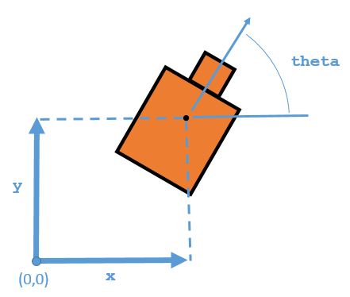

# Localization of an UAV for Crack Detection in Railwat Tracks

Gabriel D. Silva
---
---
1. Introduction   
2. MCL Algorithm
3. 2D Localization of UAV
4. Simulation Results
5. Conclusion and Future Work
---
# Introduction
- UAV applications: sports, partys, get in places where human intervation might be difficult.
- E.g.: detecting cracks in a railway track using concepts of image processing
---
# Introduction
- Study’s based in India.
- There’s a vast railway network.
- It’s been increasing in a rapid pace, however its
infrastructure’s not been able to follow it.
- It causes severe loss of valuable human life and property.
---
# Introduction
Techniques used for damage detection:
- graphical inspection;
- non-destructive testing technologies (acoustic  mission,
- ultra-sonic techniques, etc); and shuddering based global methods.

**Two-fold objective:**
- Reduce risk of rail accidents; and
- reduce manned labor required to identify cracks along
railway tracks.
---
# MCL Algorithm

**GOAL:** localizing the position of the UAV.

*How does it work?*
- Estimates its position and orientation;
- first interaction: uniform distribution;
- the later ones gets more precise.
---
# MCL Algorithm (State Representation)

- three element vector; 
- initial input;
- mean of the highest weighed cluster of particles.



---
# MCL Algorithm (Initialization of Particles)

**Global Localization**
- initial position is unknown;
- particles uniformly distributed;
- less performance. 

**Initial pose**
- initial location is given;
- more particles acummulated at the initial pose;
- more performance
---
# MCL Algorithm (Resampling Particles)
- *UpdateThreshold*: minimum amount of necessary change in the three element vector.
- *ResamplingInterval*: defines the number of necessary updates for particle resampling.
---
# CODING IN PYTHON

```python
for i in range(1,10):
    print(i)
with open('text.tex', 'w') as f:
    f.write('Hello World')
```

